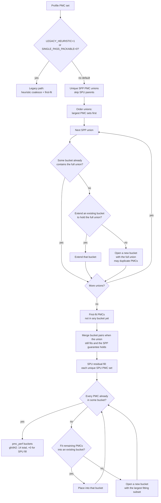

# AIPROFCOMP-865 — Metric grouping (SPP / SPU)

**Parent:** [Overall plan](aiprofcomp-865.md)

This note is the packing algorithm. Same-pass bind and SPU composite operators stay in the overall plan.

---

## 1. Algorithm

**Replace** the shipping heuristic + priority coalesce as the default allocator in
`_allocate_perfmon_counter_files`.

1. Build unique **Single-pass packable(SPP)** PMC unions (skip **Single-pass unpackable(SPU)** parents).
2. Largest-first: ensure some bucket contains each union’s full set (duplicate PMCs across passes when needed).
3. Run **SPU residual fill** so residual SPU PMC pieces appear somewhere (+0 extra passes on gfx942).
4. Harden **TCC series affinity + coverage** (and ACCUM slot charging where required). See §3.

**Locked decisions:**

- Default path is SPP packing; optional `ROCPROF_COMPUTE_PERFMON_LEGACY_HEURISTIC=1` during migration.
- Do **not** use `WEIGHTED_AVG` for former POLICY_GAP metrics — packing covers them (they are SPP).
- Priority policy YAML is not required for the packable guarantee.
- gfx942 offline packing gates: `packable_multi == 0`, passes ≈ **14**, SPU count == **16**, SPU extra passes == **0**. The `packable_multi == 0` gate is the SPP allocator before the panel-1805 grouping follow-up in §3.

**Primary packing code:** `counter_grouping_single_pass.py`, `counter_grouping_buckets.py`, `soc_base.py`.

---

## 2. Flowchart

Flow — single-pass packable + SPU residual fill (default). TCC series affinity is **not** in this chart; it is the layout harden in §3.

---

## 3. TCC series affinity + coverage

TCC channel series need packing rules beyond plain PMC-union co-location. On gfx942, TCC allows **4 event bases per pass** (channel instances `[i]` are dimensions of one base, not extra slots). Full policy (approved for design): [TCC series affinity + coverage](https://github.com/ROCm/rocm-systems/blob/users/feizheng10/aiprofcomp-865-docs-backup/projects/rocprofiler-compute/docs/plans/aiprofcomp-865-tcc-series-affinity-coverage.md).

1. Pack by **series base**; when a TCC series is selected, expand **all collectable channel instances** in that pass.
2. Keep affinity pairs in the **same pass** (e.g. `TCC_EA0_RDREQ_LEVEL` with `TCC_EA0_RDREQ`, and WR/ATOMIC analogues) so latency ratios are not joined across replays — L2 channel maps can remap between passes.
3. Cover every selected series from the profile/YAML set; do **not** prune to runtime-nonzero channels.
4. Do **not** duplicate the same per-channel REQ series into a second pass with a different channel map (orphan REQ copies invite wrong same-pass bind / cross-pass joins).

**Impact:** Enforcing this on gfx942 default SPP is a **layout** harden and does **not** add passes (**14 → 14**). It is not a Phase 2 / SPU concern. Dropping orphan `RDREQ` / `WRREQ` copies means panel **1805** (one union of read, write, and atomic columns) no longer fits one bucket, so offline `packable_multi` would read **1** unless those columns are separate packing groups.
